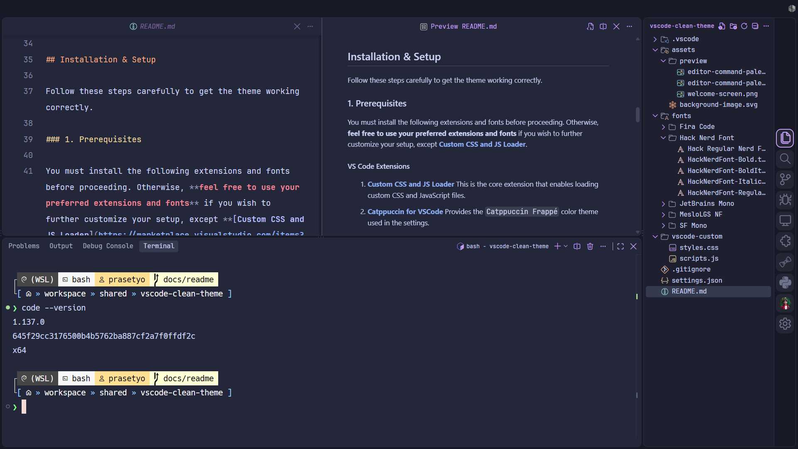

<h1 align="center">VS Code Clean Theme</h1>

<p align="center">
  A clean, focused, and highly customizable Visual Studio Code workspace.
</p>

## Table of Contents

- [Overview](#overview)
- [Key Features](#key-features)
- [Preview](#preview)
- [Repository Contents](#repository-contents)
- [Installation and Setup](#installation-and-setup)
  - [Prerequisites](#1-prerequisites)
  - [Configuration Steps](#2-configuration-steps)
    - [Step 1: Place Custom Files](#step-1-place-custom-files)
    - [Step 2: Update `settingsjson`](#step-2-update-settingsjson)
    - [Step 3: Enable Custom CSS and JS](#step-3-enable-custom-css-and-js)
  - [Verify the Installation](#verify-the-installation)
- [How the Setup Works](#how-the-setup-works)
- [Customization](#customization)
- [Maintenance and Updates](#maintenance-and-updates)
- [Troubleshooting](#troubleshooting)
- [Uninstall or Restore](#uninstall-or-restore)
- [Having Issues?](#having-issues)

## Overview

This repository contains custom **CSS**, **JavaScript**, and **JSON/JSONC settings configuration** for Visual Studio Code. It is designed to create a clean, focused, and aesthetically pleasing coding environment by removing UI clutter and adding subtle, modern animations to enhance the user experience.

The setup is intentionally provided as a starting point: you can use the included appearance and editor preferences as-is, or adjust the colors, animations, fonts, and other settings to match your workflow.

## Key Features

### Minimalist Interface

- Hides the status bar and breadcrumbs.
- Uses a single large tab to maximize screen real estate for code.
- Removes or minimizes several navigation and layout controls through `settings.json` and `styles.css`.

### Animated Command Palette

The command palette features a stylish, animated gradient border and a frosted-glass (blur) background effect, making it a central and elegant UI piece.

### Frosted-Glass Effect

A custom JavaScript file dynamically applies a blur effect to the workbench whenever the command palette is opened. Clicking the blur layer, or closing the command palette, removes the effect and restores the workbench.

### Redesigned Activity Bar

- Centers and enlarges the icons.
- Adds a rounded selection indicator for a clean, modern look.
- Moves the sidebar to the right for a less intrusive experience.

### Custom Welcome Screen

The default startup screen is replaced with a clean, custom SVG logo, maintaining the minimalist aesthetic even when no files are open.

### Enhanced Readability

Carefully selected fonts and line-height settings—particularly `JetBrains Mono` and `MesloLGS NF`—make code easy to read and pleasant to look at. The included settings also support `Fira Code`, `Hack Nerd Font`, and `SF Mono` as part of the font configuration and available font collection.

### Consistent Styling

Custom styles are applied to scrollbars, the sidebar, the find widget, and other UI elements for a cohesive experience.

## Preview

| Screen | Preview |
| --- | --- |
| Welcome screen |  |
| Command palette closed |  |
| Command palette open |  |
| Terminal open |  |

## Repository Contents

The most relevant files and directories are:

```text
.
├── assets/
│   ├── background-image.svg
│   └── preview/                 # Screenshots used in this README
├── fonts/                       # Optional font files distributed with the repository
├── settings.json                # VS Code editor and workbench configuration
└── vscode-custom/
    ├── scripts.js               # Command palette/workbench blur behavior
    └── styles.css               # Custom VS Code UI styling
```

The `fonts` directory includes the font files referenced by this setup. The custom files that must be loaded by the extension are `vscode-custom/styles.css` and `vscode-custom/scripts.js`.

## Installation and Setup

Follow these steps carefully to get the theme working correctly. The setup has three parts:

1. Install the required extensions and fonts.
2. Place the custom files and configure their absolute file paths.
3. Enable the custom CSS and JavaScript loader, then restart VS Code.

### 1. Prerequisites

You must install the following extensions and fonts before proceeding. Otherwise, **feel free to use your preferred extensions and fonts** if you wish to further customize your setup, except **[Custom CSS and JS Loader](https://marketplace.visualstudio.com/items?itemName=be5invis.vscode-custom-css)**, which is required for loading the custom files.

#### VS Code Extensions

Install these from the links below or from the VS Code Extensions view:

1. **[Custom CSS and JS Loader](https://marketplace.visualstudio.com/items?itemName=be5invis.vscode-custom-css)**
   This is the core extension that enables loading custom CSS and JavaScript files.

2. **[Catppuccin for VSCode](https://marketplace.visualstudio.com/items?itemName=Catppuccin.catppuccin-vsc)**
   Provides the `Catppuccin Frappé` color theme used in the original setup description.

3. **[Catppuccin Icons for VSCode](https://marketplace.visualstudio.com/items?itemName=Catppuccin.catppuccin-vsc-icons)**
   Supplies the Catppuccin icon theme, ensuring a cohesive and visually appealing set of icons throughout the editor.

4. **[Fluent Icons](https://marketplace.visualstudio.com/items?itemName=miguelsolorio.fluent-icons)**
   The product icon theme used for a consistent UI.

> **Theme note**
> The original setup description refers to `Catppuccin Frappé`. The included `settings.json` currently sets `Catppuccin Macchiato` as `workbench.colorTheme`. Both themes are provided by the Catppuccin extension; choose the one you prefer by changing that setting.

#### Fonts

You can download the required fonts from the `fonts` directory included in this repository, or from the sources linked below:

1. **[JetBrains Mono](https://www.jetbrains.com/lp/mono/)**
2. **[MesloLGS NF](https://github.com/kalaschnik/meslolgs-nf-template)**
3. **[Fira Code](https://github.com/tonsky/FiraCode)**
4. **[Hack Nerd Font](https://github.com/ryanoasis/nerd-fonts/releases/download/v3.4.0/Hack.zip)**
5. **[SF Mono](https://font.download/font/sf-mono)**

Install the fonts at the operating-system level before opening VS Code again. If a font is unavailable, VS Code will fall back to the next font in the configured font-family list.

### 2. Configuration Steps

#### Step 1: Place Custom Files

1. Create a dedicated folder for your VS Code custom files. A common location is in your **user home** directory.

   - **Windows**

     Create a folder at `C:\Users\YourUsername\.vscode\vscode-custom`. Replace `YourUsername` with your actual Windows username.

     Example:

     ```text
     C:\Users\izprstyo\.vscode\vscode-custom
     ```

   - **MacOS/Linux**

     Create a folder at `~/.vscode/vscode-custom`.

     You can do this from the terminal with:

     ```sh
     mkdir -p ~/.vscode/vscode-custom
     ```

   This folder will store your custom CSS and JS files. For more details, see the **[Custom CSS and JS Loader](https://marketplace.visualstudio.com/items?itemName=be5invis.vscode-custom-css)** documentation.

2. Copy the `styles.css` and `scripts.js` files from this repository into the folder you just created:

   ```text
   <your-user-home>/.vscode/vscode-custom/styles.css
   <your-user-home>/.vscode/vscode-custom/scripts.js
   ```

   On Windows, use the equivalent `C:\Users\YourUsername\.vscode\vscode-custom\` path.

> **Tip:** Back up your current VS Code settings and custom files before replacing or editing them. This makes it easier to revert the setup if necessary.

#### Step 2: Update `settings.json`

1. Open your Visual Studio Code `settings.json` file. You can do this by opening the Command Palette (`Ctrl + Shift + P` or `Cmd + Shift + P`) and searching for `Preferences: Open User Settings (JSON)`.

2. Copy the entire content of the provided `settings.json` file from this repository and paste it into your own `settings.json` file.

   The provided file contains editor, terminal, workbench, theme, icon, formatting, and `vscode_custom_css.imports` settings. If you already have personal settings, save a backup first and merge the relevant entries instead of unintentionally overwriting them.

   > **IMPORTANT**
   > You must update the file paths within the `vscode_custom_css.imports` setting to match the location where you saved your files in **[Step 1](#step-1-place-custom-files)**.

   Use absolute `file:///` URI paths. Replace the example username with your own username, and keep the forward-slash format shown below.

   For example:

   ```jsonc
   /* Windows */
   "vscode_custom_css.imports": [
       "file:///C:/Users/izprstyo/.vscode/vscode-custom/styles.css",
       "file:///C:/Users/izprstyo/.vscode/vscode-custom/scripts.js"
   ]

   /* MacOS */
   "vscode_custom_css.imports": [
       "file:///Users/izprstyo/.vscode/vscode-custom/styles.css",
       "file:///Users/izprstyo/.vscode/vscode-custom/scripts.js"
   ]

   /* Linux */
   "vscode_custom_css.imports": [
       "file:///home/izprstyo/.vscode/vscode-custom/styles.css",
       "file:///home/izprstyo/.vscode/vscode-custom/scripts.js"
   ]
   ```

   The examples above are JSONC snippets because the comments are included for platform labels. Do not add multiple `vscode_custom_css.imports` keys to the same settings file.

#### Step 3: Enable Custom CSS and JS

1. Open the Command Palette (`Ctrl + Shift + P` or `Cmd + Shift + P`).
2. Run the command: `Enable Custom CSS and JS`.
3. Restart Visual Studio Code when prompted.

   > **NOTE**
   > After enabling, VS Code may show a notification saying **"Your Code installation is corrupt or has been modified"**. This is expected because the extension modifies core files to inject the custom CSS and JS. You can safely dismiss this warning by clicking the gear icon and choosing **"Don't Show Again"**.

   > **IMPORTANT**
   > After every Visual Studio Code update, you must run the `Reload Custom CSS and JS` command from the Command Palette to reload the extension and reapply your custom CSS and JS.

You're all set! Enjoy your new clean and focused coding environment.

### Verify the Installation

After restarting VS Code, check the following:

- The status bar and breadcrumbs are hidden.
- The editor opens with the configured single-tab layout.
- The sidebar is on the right and the activity-bar icons are centered.
- The custom welcome screen appears when no files are open.
- Opening the Command Palette shows the animated border and applies the frosted-glass workbench effect.
- The terminal uses the configured font and line height.

If these changes do not appear, review the path and troubleshooting sections below, then run `Reload Custom CSS and JS` again.

## How the Setup Works

- **`settings.json`** controls VS Code preferences such as the color theme, icon themes, editor typography, tab behavior, sidebar location, status-bar visibility, terminal appearance, and the custom-file import paths.
- **`vscode-custom/styles.css`** changes the visual presentation of the workbench, including the title bar, tabs, activity bar, scrollbars, sidebar, command palette, find widget, and other UI elements.
- **`vscode-custom/scripts.js`** watches for the command palette (`.quick-input-widget`) and adds or removes a `#bg-blur` layer on the workbench while the palette is visible.
- **`assets/background-image.svg`** and the files in `assets/preview/` support the custom welcome-screen appearance and project documentation previews.

The exact appearance can vary slightly between VS Code versions, operating systems, display scaling, and installed extensions because the CSS targets VS Code's internal UI classes.

## Customization

Feel free to tweak the `styles.css`, `scripts.js`, and `settings.json` files to match your personal preferences. The provided configuration is a great starting point for building your own perfect setup. You can change colors, animations, font sizes, or any other setting to your liking.

Common customization points include:

- `workbench.colorTheme` and `workbench.iconTheme` for colors and file icons.
- `editor.fontFamily`, `editor.fontSize`, `editor.lineHeight`, and terminal font settings for readability.
- CSS variables, borders, shadows, and animation rules in `styles.css` for the visual treatment.
- The blur behavior in `scripts.js` if you want to change when the workbench overlay appears.

> **IMPORTANT**
> If you make any changes to your custom styles or scripts, you must run the command: `Reload Custom CSS and JS` from the Command Palette for your changes to take effect.

## Maintenance and Updates

- Keep a copy of your customized `styles.css`, `scripts.js`, and `settings.json` before updating this repository or VS Code.
- Review changes to `settings.json` before copying a newer version so your personal settings are not lost.
- After every Visual Studio Code update, run `Reload Custom CSS and JS`.
- If a VS Code update disables the customization, run `Enable Custom CSS and JS` again, restart VS Code, and then reload the custom files.
- Recheck the `vscode_custom_css.imports` paths if any custom files are moved or renamed.

## Troubleshooting

### Custom styling does not appear

1. Confirm that `styles.css` and `scripts.js` exist in the configured custom folder.
2. Confirm that both entries in `vscode_custom_css.imports` use the correct absolute `file:///` paths.
3. Run `Enable Custom CSS and JS` and restart VS Code.
4. Run `Reload Custom CSS and JS` after the restart.
5. Check that the **Custom CSS and JS Loader** extension is installed and enabled.

### The command palette blur does not work

- Confirm that `scripts.js` is included in `vscode_custom_css.imports`.
- Reload the custom CSS and JS files.
- Restart VS Code if the command palette was already open while the script was reloaded.
- Remember that changes in VS Code's internal UI may affect the selectors used by the script.

### Fonts or icons look different

- Confirm that the fonts have been installed at the operating-system level.
- Check the spelling of the font family names.
- Confirm that the Catppuccin and Fluent Icons extensions are installed.
- Restart VS Code after installing fonts or extensions.

### VS Code reports that the installation is corrupt or modified

This warning is expected when **Custom CSS and JS Loader** modifies VS Code core files. You can safely dismiss it by clicking the gear icon and choosing **"Don't Show Again"**, as described in the installation steps.

## Uninstall or Restore

To stop using the customization:

1. Run `Disable Custom CSS and JS` from the Command Palette, if the command is available.
2. Remove the `vscode_custom_css.imports` entries from your `settings.json`.
3. Restore your previous settings and custom files from the backup you made before installation.
4. Optionally uninstall **Custom CSS and JS Loader** and the optional theme, icon, and font components.
5. Restart VS Code.

## Having Issues?

If you run into any problems during setup or have questions, please feel free to [open an issue](https://docs.github.com/en/issues/tracking-your-work-with-issues/using-issues/creating-an-issue) on this GitHub repository. I'll do my best to help you out.

---

<p align="center">© 2026 izprstyo</p>
