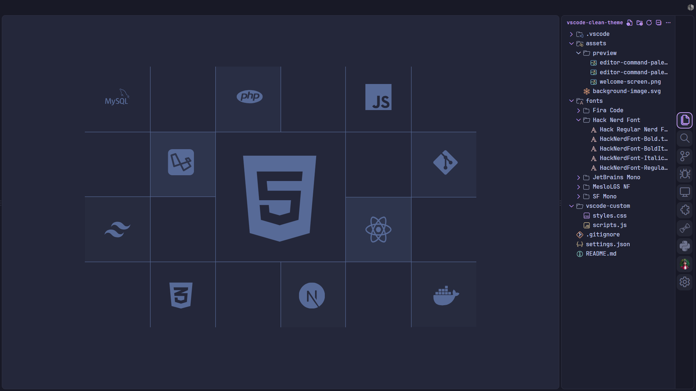
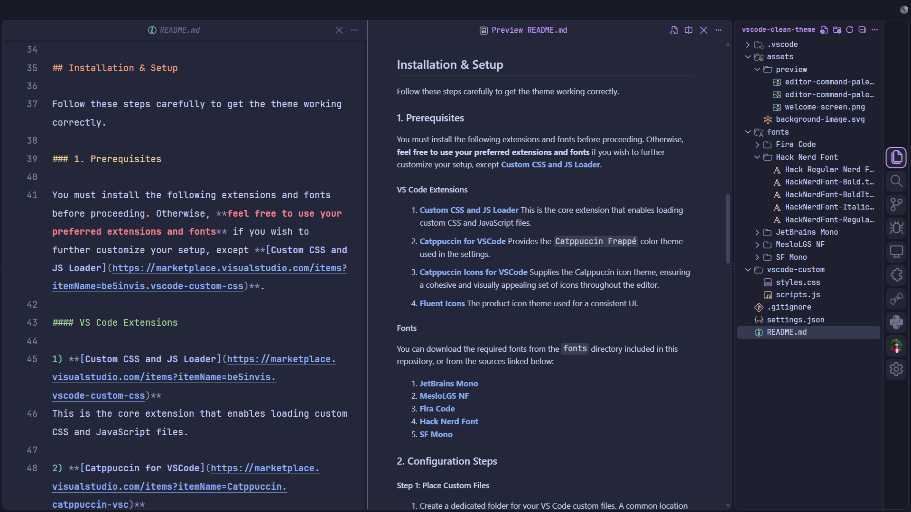
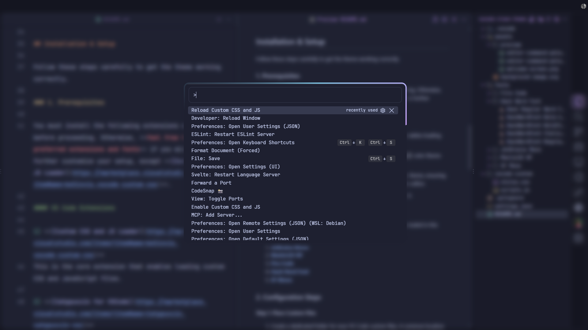

<h1 align="center">VS Code Clean Theme</h1>

## Description

A custom CSS, JS, and JSON (settings configuration) for Visual Studio Code designed to create a clean, focused, and aesthetically pleasing coding environment. This setup removes UI clutter and adds subtle, modern animations to enhance the user experience.

## Key Features

- **Minimalist Interface**
Hides the status bar, breadcrumbs, and uses single large tab to maximize screen real estate for your code.

- **Animated Command Palette**
The command palette features a stylish, animated gradient border and a frosted glass (blur) background effect, making it a central and elegant UI piece.

- **Frosted Glass Effect**
A custom JavaScript dynamically applies a blur effect to the workbench whenever the command palette is opened, improving focus.

- **Redesigned Activity Bar**
Icons are centered, enlarged, and have a rounded selection indicator for a clean, modern look. The sidebar is moved to the right for a less intrusive experience.

- **Custom Welcome Screen**
The default startup screen is replaced with a clean, custom SVG logo, maintaining the minimalist aesthetic even when no files are open.

- **Enhanced Readability**
Carefully selected fonts and line height settings (`JetBrains Mono` and `MesloLGS NF`) ensure code is easy to read and beautiful to look at.

- **Consistent Styling**
Custom styles are applied to scrollbars, the sidebar, find widget, and other UI elements for a cohesive experience.

## Preview





## Installation & Setup

Follow these steps carefully to get the theme working correctly.

### 1. Prerequisites

You must install the following extensions and fonts before proceeding. Otherwise, **feel free to use your preferred extensions and fonts** if you wish to further customize your setup, except **[Custom CSS and JS Loader](https://marketplace.visualstudio.com/items?itemName=be5invis.vscode-custom-css)**.

#### VS Code Extensions

1) **[Custom CSS and JS Loader](https://marketplace.visualstudio.com/items?itemName=be5invis.vscode-custom-css)**
This is the core extension that enables loading custom CSS and JavaScript files.

2) **[Catppuccin for VSCode](https://marketplace.visualstudio.com/items?itemName=Catppuccin.catppuccin-vsc)**
Provides the `Catppuccin Frappé` color theme used in the settings.

3) **[Catppuccin Icons for VSCode](https://marketplace.visualstudio.com/items?itemName=Catppuccin.catppuccin-vsc-icons)**
Supplies the Catppuccin icon theme, ensuring a cohesive and visually appealing set of icons throughout the editor.

4) **[Fluent Icons](https://marketplace.visualstudio.com/items?itemName=miguelsolorio.fluent-icons)**
The product icon theme used for a consistent UI.

#### Fonts

You can download the required fonts from the `fonts` directory included in this repository, or from the sources linked below:

1) **[JetBrains Mono](https://www.jetbrains.com/lp/mono/)**
2) **[MesloLGS NF](https://github.com/kalaschnik/meslolgs-nf-template)**
3) **[Fira Code](https://github.com/tonsky/FiraCode)**
4) **[Hack Nerd Font](https://github.com/ryanoasis/nerd-fonts/releases/download/v3.4.0/Hack.zip)**
5) **[SF Mono](https://font.download/font/sf-mono)**

### 2. Configuration Steps

#### Step 1: Place Custom Files

1) Create a dedicated folder for your VS Code custom files. A common location is in your **user home** directory.
    - **Windows**
        Create a folder at `C:\Users\YourUsername\.vscode\vscode-custom`. Replace `YourUsername` with your actual Windows username.

        Example:
        ```
        C:\Users\aziz-prasetyo\.vscode\vscode-custom
        ```

    - **MacOS/Linux**
        Create a folder at `~/.vscode/vscode-custom`.

        You can do this from the terminal with:
        ```sh
        mkdir -p ~/.vscode/vscode-custom
        ```

    This folder will store your custom CSS and JS files. For more details, see the **[Custom CSS and JS Loader](https://marketplace.visualstudio.com/items?itemName=be5invis.vscode-custom-css)** documentation.

2) Copy the `styles.css` and `scripts.js` files from this repository into the folder you just created.

#### Step 2: Update `settings.json`

1) Open your Visual Studio Code `settings.json` file. You can do this by opening the Command Palette (`Ctrl + Shift + P` or `Cmd + Shift + P`) and searching for `Preferences: Open User Settings (JSON)`.

2) Copy the entire content of the provided `settings.json` file from this repository and paste it into your own `settings.json` file.

    >**IMPORTANT**
    You must update the file paths within the `vscode_custom_css.imports` setting to match the location where you saved your files in **[Step 1](#step-1-place-custom-files)**.

    For example:
    ```json
    /* Windows */
    "vscode_custom_css.imports": [
        "file:///C:/Users/aziz-prasetyo/.vscode/vscode-custom/styles.css",
        "file:///C:/Users/aziz-prasetyo/.vscode/vscode-custom/scripts.js"
    ]

    /* MacOS */
    "vscode_custom_css.imports": [
        "file:///Users/aziz-prasetyo/.vscode/vscode-custom/styles.css",
        "file:///Users/aziz-prasetyo/.vscode/vscode-custom/scripts.js"
    ]

    /* Linux */
    "vscode_custom_css.imports": [
        "file:///home/aziz-prasetyo/.vscode/vscode-custom/styles.css",
        "file:///home/aziz-prasetyo/.vscode/vscode-custom/scripts.js"
    ]
    ```

#### Step 3: Enable Custom CSS and JS

1) Open the Command Palette (`Ctrl + Shift + P` or `Cmd + Shift + P`).

2) Run the command: `Enable Custom CSS and JS`.

3) Restart Visual Studio Code when prompted.

    >**NOTE**
    After enabling, VS Code may show a notification saying "Your Code installation is corrupt or has been modified". This is expected because the extension modifies core files to inject the custom CSS and JS. You can safely dismiss this warning by clicking the gear icon and choosing "Don't Show Again".

You're all set! Enjoy your new clean and focused coding environment.

## Customization

Feel free to tweak the `styles.css`, `scripts.js`, and `settings.json` files to match your personal preferences. The provided configuration is a great starting point for building your own perfect setup. You can change colors, animations, font sizes, or any other setting to your liking.

> **IMPORTANT**
If you make any changes to your custom styles or scripts, you must run the command: `Reload Custom CSS and JS` from the Command Palette for your changes to take effect.

## Having Issues?

If you run into any problems during setup or have questions, please feel free to [open an issue](https://docs.github.com/en/issues/tracking-your-work-with-issues/using-issues/creating-an-issue) on this GitHub repository. I'll do my best to help you out.

---

<p align="center">© 2026 izpsrtyo</p>
